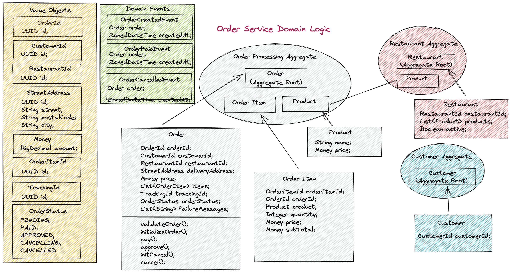
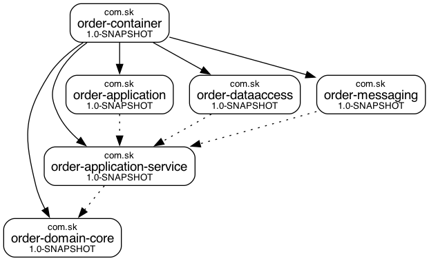

# 시스템 도메인 구성도

# graphviz(모듈 그래프 시각화 도구) 사용법

 - graphviz 를 먼저 설치해야 함
    : brew install graphviz

1) pom.xml 에 아래 플러그인 추가 

~~~xml
   <plugin>
       <groupId>com.github.ferstl</groupId>
       <artifactId>depgraph-maven-plugin</artifactId>
       <version>4.0.2</version>
       <configuration>
           <createImage>true</createImage>
           <showGroupIds>true</showGroupIds>
           <showVersions>true</showVersions>
           <showDuplicates>true</showDuplicates>
           <showConflicts>true</showConflicts>
       </configuration>
   </plugin>
~~~
2) mvn 명령어 실행
  : mvn depgraph:graph

3) order-container 하위에 dependency-graph.png 파일 생성

# 주문 생성 요청 흐름도
